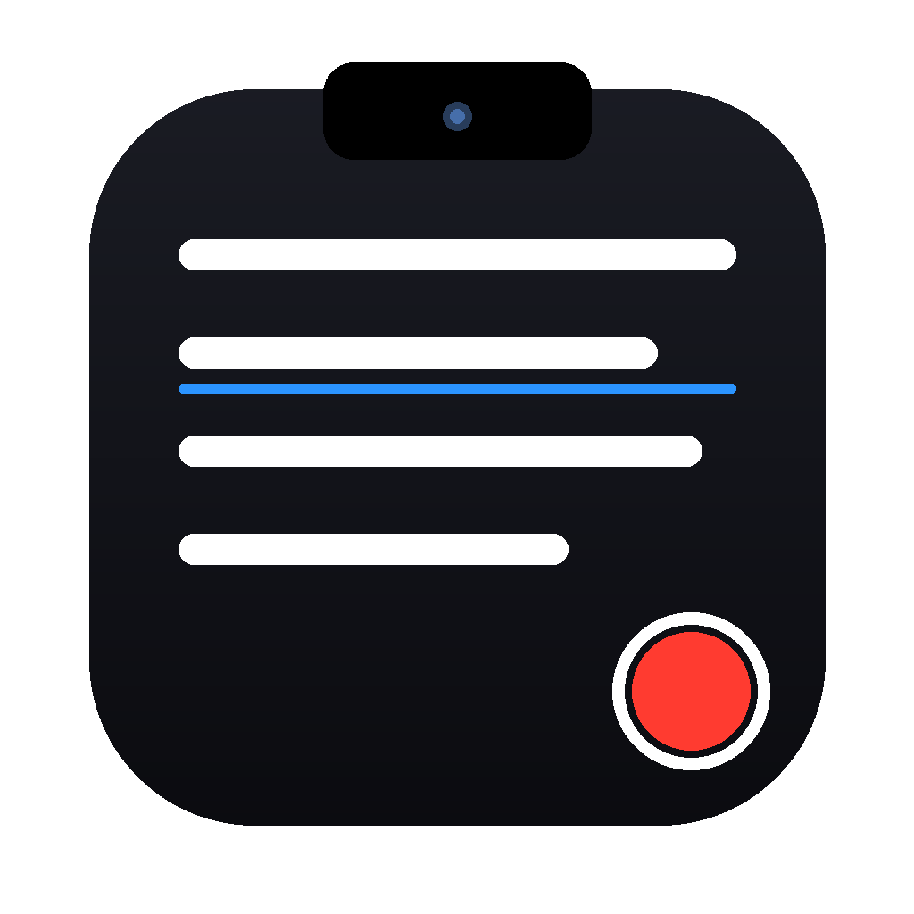

# CamPrompt — телесуфлёр под камерой MacBook

Нативное macOS-приложение: профессиональный телесуфлёр, оптимизированный под запись видео прямо на MacBook. Текст плавно прокручивается **прямо под камерой (в зоне notch)** — глаза остаются направленными в объектив. Запись видео и звука — внутри самого приложения.



## Чем отличается от существующих

Notch-телесуфлёры (Notchie, CueNotch, Textream, NotchPrompt) не записывают видео. Приложения с записью (Teleprompter Premium, BIGVU) не умеют держать текст у камеры. CamPrompt делает и то и другое.

## Возможности

- Плавающая панель суфлёра, закреплённая под notch — поверх всех приложений (включая fullscreen).
- Плавный автоскролл со строкой-якорем, скорость 1–100, пауза/пуск/с начала, луп.
- Плашка управления прямо на суфлёре: пуск/пауза, «с начала», скорость кнопками ±1 или вводом числа.
- Библиотека скриптов со встроенным редактором.
- Настройка текста: шрифт, размер, жирность, цвета, прозрачность фона, межстрочный интервал, отступы, выравнивание, зеркальный текст (для beam-splitter ригов).
- Камера: живое превью, выбор камеры (встроенная / Continuity / внешняя) и микрофона, зеркальное превью.
- Запись видео+звука (H.264/AAC, .mov, 1080p — или максимум камеры, например 720p на MacBook Air M1 и 13″ MacBook Pro) в папку `Teleprompter` внутри Загрузок/Документов/Фильмов (настраивается), обратный отсчёт, таймер записи, список записей.
- Качество записи на выбор: Экономно / Стандарт / Максимум. «Стандарт» (HEVC) — около 0,8 ГБ за 30 минут вместо 3 ГБ (v0.3).
- Размер окна суфлёра меняется мышью: потяните за левый, правый или нижний край (v0.2).
- У каждого ползунка настроек есть поле с числом — точное значение можно вписать с клавиатуры (v0.2).
- Камера → «Скопировать диагностику»: отчёт о камерах, разрешениях и сессии записи для разбора проблем (v0.2).
- Опция «прятать суфлёр от записи экрана» (Zoom/OBS/QuickTime не увидят текст).

## Установка

1. Скачайте `.dmg` из [Releases](../../releases/latest) и откройте.
2. Перетащите **CamPrompt** в **Applications**.
3. Приложение пока не нотарифицировано, поэтому один раз выполните в Терминале:
   ```
   xattr -dr com.apple.quarantine /Applications/CamPrompt.app
   ```
4. Запустите, разрешите доступ к камере и микрофону.

Требуется macOS 14 (Sonoma) или новее. Оптимизировано под MacBook с notch (2021+), но работает на любом Mac.

## Если камера не включается

1. Обновитесь до v0.2.0 или новее. До неё встроенная камера 720p (MacBook Air M1 2020, все 13″ MacBook Pro) молча не подключалась — чёрное превью, а в записи только звук; айфоны через Continuity при этом работали. Причина: приложение требовало от камеры 1080p ещё до её подключения.
2. Проверьте разрешение: Системные настройки → Конфиденциальность и безопасность → Камера → CamPrompt включён.
3. Закройте другие приложения с камерой (FaceTime, Zoom, Photo Booth) и нажмите «Включить камеру».
4. Если не помогло — Камера (кнопка в тулбаре) → «Скопировать диагностику» и пришлите текст из буфера обмена: в нём список камер с их разрешениями и состояние сессии записи.

## Горячие клавиши

`Пробел` пауза/пуск · `R` с начала · `↑/↓` скорость ±5 · `←/→` перемотка · `Esc` скрыть суфлёр · `⌘T` показать/скрыть суфлёр · `⌘E` запись · `⌘N` новый скрипт.

Работают, пока CamPrompt — активное приложение.

## Сборка из исходников

```bash
swift build                       # проверка компиляции (нужен macOS)
bash scripts/build_app.sh 0.2.2   # соберёт dist/CamPrompt.app + .dmg
```

CI (GitHub Actions, macos-15) собирает `.dmg` на каждый пуш в `main`; тег `v*` публикует Release. Сборка возможна **только на macOS** — среда разработки Linux, поэтому единственный путь релиза лежит через CI.

## Архитектура

SwiftUI (содержимое) + AppKit (окна), без внешних зависимостей:

- `PrompterPanelController` — borderless `NSPanel` (`.nonactivatingPanel`, level `.screenSaver`, `canJoinAllSpaces + fullScreenAuxiliary`), позиция по геометрии экрана с вырезом, ресайз за края.
- `ScrollEngine` — таймер 60 Гц, смещение текста, луп.
- `CaptureManager` — `AVCaptureSession` + `AVCaptureMovieFileOutput` (превью, запись, диагностика).
- `ScriptStore` / `SettingsStore` / `RecordingsStore` — хранение (JSON + UserDefaults + файлы).

## Документация

| Файл | О чём |
|---|---|
| [CLAUDE.md](CLAUDE.md) | Правила работы в репозитории (для разработчика и ИИ-агента) |
| [docs/AGENT_ONBOARDING.md](docs/AGENT_ONBOARDING.md) | **Точка входа:** контекст, карта, первый цикл правки |
| [docs/ARCHITECTURE.md](docs/ARCHITECTURE.md) | Слои, точки входа, сценарий записи, геометрия панели, ключи настроек, карта файлов |
| [docs/DECISIONS.md](docs/DECISIONS.md) | Журнал решений: что выбрали, что отклонили и почему; разбор инцидентов |
| [CHANGELOG.md](CHANGELOG.md) | История версий |
| [docs/TROUBLESHOOTING.md](docs/TROUBLESHOOTING.md) | Симптом → причина → что делать; отладка без Mac |
| [docs/RISKS.md](docs/RISKS.md) | Ограничения macOS, чек-лист приёмки |
| [docs/DEV_PLAN.md](docs/DEV_PLAN.md) | Вехи M0–M6, что дальше |
| [docs/RESEARCH.md](docs/RESEARCH.md) | Обзор рынка и техническая разведка (июль 2026) |

## Лицензия

MIT. Паттерны оконного слоя изучены по MIT-проектам [Textream](https://github.com/f/textream), [NotchPrompt](https://github.com/aliarain/notchprompt), [Peek](https://github.com/guajardo/peek).
